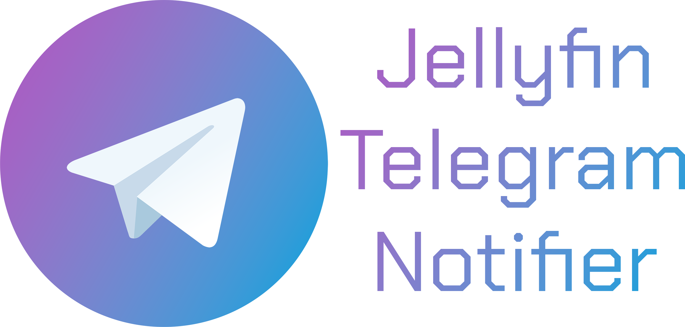
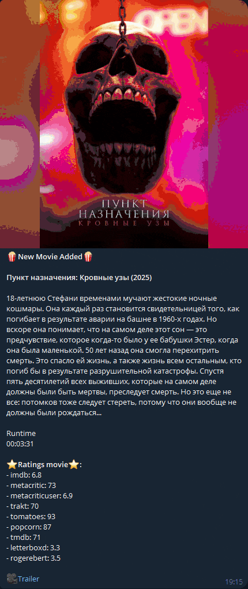

<div align="center">
  
  <h1>Jellyfin Notification System</h1>
</div>

A simple Flask application that sends notifications to Telegram whenever new content (movies, series, seasons, episodes, album) is added to Jellyfin.

<div align="center">
  
</div>

---

## Features

- Sends Telegram notifications with media images whenever a new movie, series, season, episode or album is added to Jellyfin.
- Integrates with the Jellyfin webhook plugin.
- Provides a filter to notify only for recent episodes or newly added seasons.
- Shows ratings from popular platforms for added movies and series.
- Adds a youtube link to the message with a trailer for a movie or series.

## Prerequisites

- A Jellyfin server with the Webhook, TMDb plugins and installed.
- A Telegram bot token and chat ID (see the section on setting up a Telegram bot below).
- API KEY for MDBLIST, TMDB and Youtube
- Docker (optional, for Docker installation).

## Installation

### Traditional Installation

1. Clone the repository.
2. Install the requirements using `pip install -r requirements.txt`.
3. Set up your environment variables. (TELEGRAM_BOT_TOKEN, TELEGRAM_CHAT_ID, JELLYFIN_BASE_URL, JELLYFIN_API_KEY, YOUTUBE_API_KEY, MDBLIST_API_KEY, TMDB_API_KEY, EPISODE_PREMIERED_WITHIN_X_DAYS, SEASON_ADDED_WITHIN_X_DAYS).
4. Run the application using `python3 app.py`.

### Docker Installation

If you have Docker and Docker Compose installed, you can use the provided `docker-compose.yml`

```
version: '3'
services:
  jellyfin-telegram-notifier:
    container_name: jellyfin-telegram-notifier
    image: druidblack/jellyfin-telegram-notifie:latest
    ports:
      - "5000:5000"  # Map host port 5000 to container port 5000
    environment:
      - TELEGRAM_BOT_TOKEN=9059476951:AAGgchDa2cQq0XYK3Uki2IsGpQk1g4hPD7
      - TELEGRAM_CHAT_ID=501990748
      - JELLYFIN_BASE_URL=http://192.168.1.161:8096
      - JELLYFIN_API_KEY=wq0ac26fb67e4bb4a8185fb302923296
      - MDBLIST_API_KEY=wq000002er0urju0fdhjb0tp
      - TMDB_API_KEY=9ebb4bcd533519ew2c00ba8f000e000e
      - YOUTUBE_API_KEY=AIzTSygtyBFfMbzo8LTfwF8DDTmZshkFhaA8wWg
      - SEASON_ADDED_WITHIN_X_DAYS=3
      - EPISODE_PREMIERED_WITHIN_X_DAYS=7
```

## Setting Up a Telegram Bot

1. Start a Chat with BotFather on Telegram.
2. Send `/newbot` command.
3. Name your bot.
4. Choose a unique username for your bot; it must end in `bot`.
5. Retrieve your HTTP API token.
6. Get your chat ID by starting a chat with your bot, sending a message, then visiting `https://api.telegram.org/botYOUR_BOT_TOKEN/getUpdates` to find the chat ID in the returned JSON.
7. Input the Bot Token and Chat ID into the application's environment variables.

## Setting Up YouTube API Key

1. Go to the [Google Cloud Console](https://console.cloud.google.com/).
2. Create a new project or use an existing one.
3. Enable the "YouTube Data API v3" for your project.
4. Create credentials for your project:
   - Go to the "Credentials" tab.
   - Click on "Create Credentials" and select "API Key".
5. Copy the generated API key.
6. Input the `YOUTUBE_API_KEY` into the application's environment variables.

## Setting Up Mdblist API Key
1. Go to the [mdblist.com](https://mdblist.com).
2. Log in to the website.
3. Go to the https://mdblist.com/preferences .
4. Copy the generated API key.
5. Input the `MDBLIST_API_KEY` into the application's environment variables.

## Setting Up TheMovieDB API Key
1. Go to the [TheMovieDB](https://www.themoviedb.org0.
2. Log in to the website.
3. Go to the https://www.themoviedb.org/settings/api .
4. Copy the generated API key.
5. Input the `TMDB_API_KEY` into the application's environment variables.

## Usage

### Setting up Jellyfin Webhook

1. Go to Jellyfin dashboard.
2. Navigate to `Plugins`.
3. Choose `Webhook` and add a new webhook.
4. Set the server to the Flask application's endpoint (e.g., `http://localhost:5000/webhook`).
5. For `Notification Type`, select `Item Added`.
6. For `Item Type`, select `Movie, Episode, Season, Album`.
7. Make sure to enable the `Send All Properties (ignores template)` option.

#### Environment Variables Explanation:

- **`EPISODE_PREMIERED_WITHIN_X_DAYS`**:
  Determines how recent an episode's premiere date must be for a notification to be sent. For example, setting it to `7` means only episodes that premiered within the last 7 days will trigger a notification.

- **`SEASON_ADDED_WITHIN_X_DAYS`**:
  Dictates the threshold for sending notifications based on when a season was added to Jellyfin. If set to `3`, then if a season was added within the last 3 days, episode notifications will not be sent to avoid potential spam from adding an entire season at once.

## Contributing

Contributions are welcome! Feel free to open issues or submit pull requests for new features, bug fixes, or improvements.

## License

This project is licensed under the MIT License. See the [LICENSE](LICENSE) file for details.
